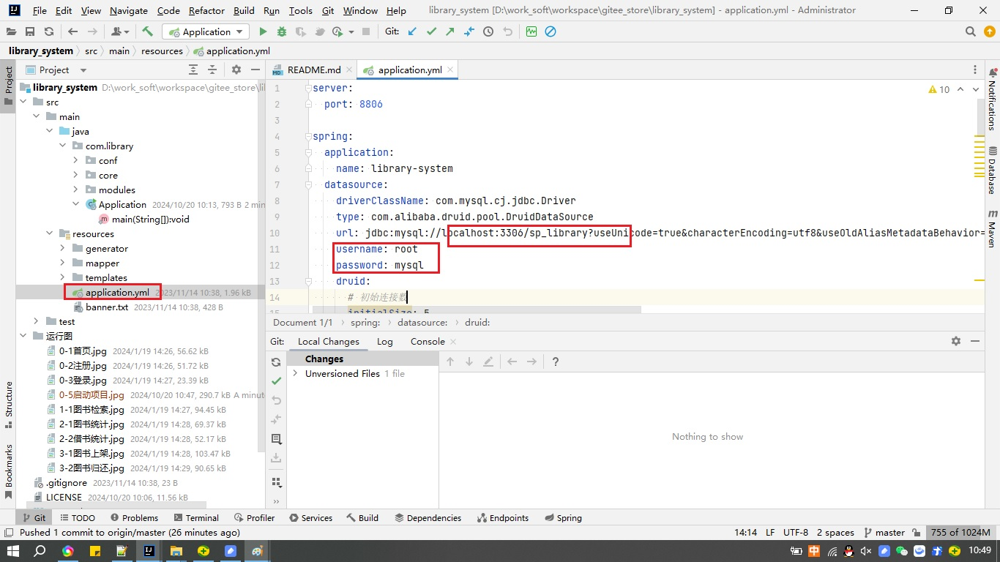
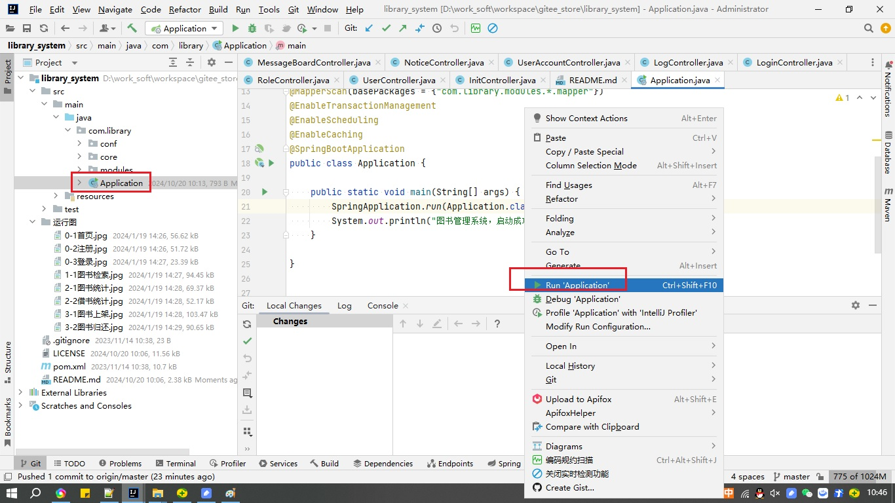

# 7.图书管理系统

## 一、系统介绍
本系统为图书管理系统，主要围绕图书管理和会员管理两个核心内容展开，图书管理包括图书的上架，下架，图书的借阅，归还，定损等；
会员管理包括会员注册，充值，损坏扣费，延期归还扣费，用户借阅记录等。

系统默认有三个角色：管理员，会员，普通用户
- 管理员（admin/admin）：可以操作所有功能
- 会员(身份证号/身份证号后6位)：
- 普通用户（身份证号/身份证号后6位）：
## 二、角色运行图
### 首页

### 注册

### 登录

### 图书检索

### 图书统计

### 借书统计

### 图书上架

### 图书归还

## 四、软件架构

基础环境：
1. JDK:1.8
2. MySQL:5.7
3. Maven3.0

使用框架：

1. 核心框架：Spring Boot 2.3.12.RELEASE
2. ORM框架：mybatis 3.4.0
3. 数据库连接池：Druid 1.2.8
4. 安全框架：Apache Shiro 1.8.0
5. 日志：SLF4J，Log4j
6. 前端框架：LayUI,jquery,ECharts

## 五、安装教程
1. 导入mysql脚本,数据库名称：sp_library
2. 修改数据库配置：

3. 启动java工程

4. 访问：http://localhost:8806（账号admin/admin）

## 六、源码地址
0. QQ:553039957
1. gitee（码云）主页： https://gitee.com/woshimalong
2. gitcode主页： https://gitcode.com/user/tbb414
3. github主页：https://github.com/doudoutangs
## 七、其他项目
1. [招投标管理系统](https://gitee.com/woshimalong/tender_system)
2. [办公管理系统](https://gitee.com/woshimalong/office_system)
3. [薪资管理系统](https://gitee.com/woshimalong/wages_system)
4. [人事管理系统](https://gitee.com/woshimalong/hr_system)
5. [绩效考核系统](https://gitee.com/woshimalong/kpi_system)
6. [就业管理系统](https://gitee.com/woshimalong/job_system)
7. [图书管理系统](https://gitee.com/woshimalong/library_system)